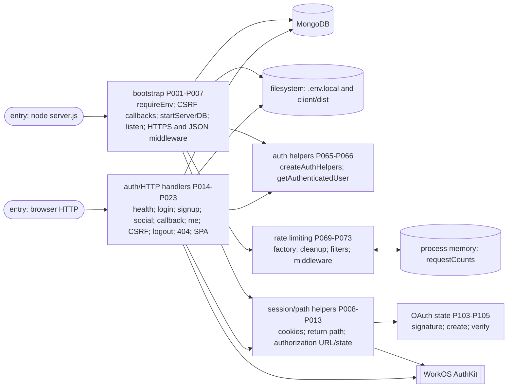
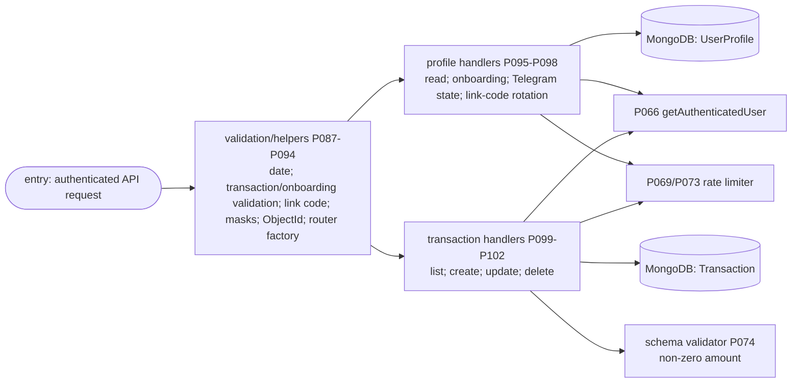
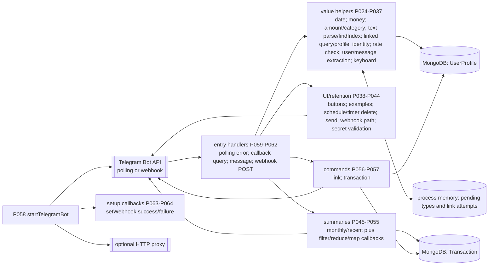
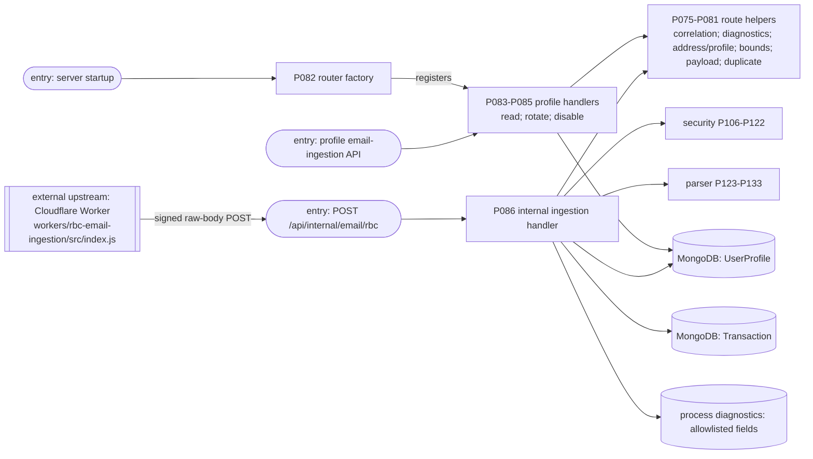
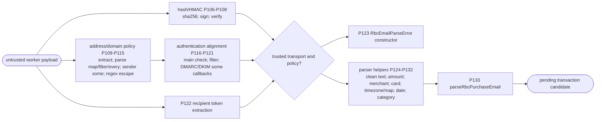
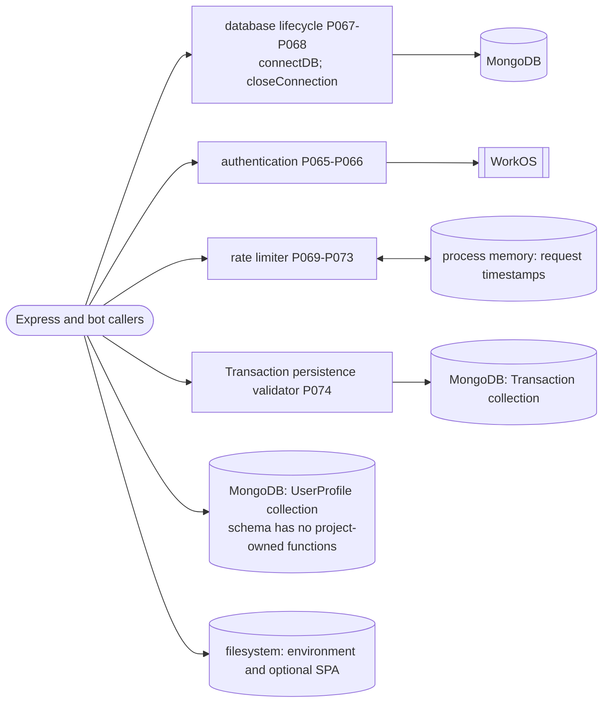
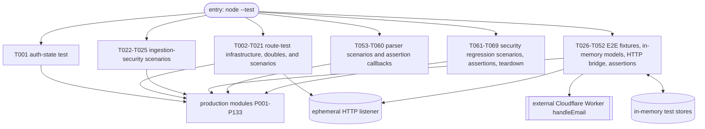

# Server JavaScript Architecture

## Scope and counting

This document describes project-owned JavaScript under `server/` as it exists after the current comment edits. It excludes `node_modules/`, generated files, sample JSON, environment files, package metadata, and the independently deployed Cloudflare Worker. [`../workers/rbc-email-ingestion/src/index.js`](../workers/rbc-email-ingestion/src/index.js) is shown only as an external upstream component because the end-to-end test imports its `handleEmail` export.

The inventory was generated from the AST of every scoped file parsed as an ECMAScript module. A source-defined function is exactly one `FunctionDeclaration`, `FunctionExpression`, or `ArrowFunctionExpression` node. This includes class constructors, object methods, schema validators, route/event/test handlers, Promise/timer callbacks, and meaningful array callbacks. Imported or previously defined function references passed as callbacks are uses, not new definitions, and are not counted. Empty files count as zero. Comments are checked against the function node (or its containing method/property/registration statement) and must be the immediately preceding explanatory comment; exported or reusable functions use JSDoc, while local and inline callbacks use `//` comments.

**Verified source result: 202 functions: 133 production and 69 tests.** The requested 203/133/70 split does not match the current source. Production is exactly 133; tests are one short of 70. There is no syntactically ambiguous test function: counting `server.listen(..., resolve)` or `Array.from(..., createTelegramLinkCode)` as another function would double-count a reference to an existing callable and would make the methodology inconsistent. All 202 source-defined functions are indexed and occur in at least one chart below.

Stable IDs are `P001`-`P133` for production and `T001`-`T069` for tests. IDs describe this snapshot; line numbers are included to make re-inventory straightforward.

## Per-file counts

| File | Kind | Count |
|---|---:|---:|
| `server.js` | production | 23 |
| `bot/bot.js` | production | 41 |
| `bot/transaction.js` | production | 0 |
| `config/auth.js` | production | 2 |
| `config/db.js` | production | 2 |
| `config/rateLimit.js` | production | 5 |
| `model/data.js` | production | 1 |
| `model/userProfile.js` | production | 0 |
| `routes/emailIngestion.js` | production | 12 |
| `routes/route.js` | production | 16 |
| `services/authState.js` | production | 3 |
| `services/emailIngestionSecurity.js` | production | 17 |
| `services/rbcEmailParser.js` | production | 11 |
| **Production subtotal** | | **133** |
| `test/authState.test.js` | test | 1 |
| `test/emailIngestionRoute.test.js` | test | 20 |
| `test/emailIngestionSecurity.test.js` | test | 4 |
| `test/rbcEmailIngestionE2E.test.js` | test | 27 |
| `test/rbcEmailParser.test.js` | test | 8 |
| `test/securityRegression.test.js` | test | 9 |
| **Test subtotal** | | **69** |
| **Scoped total** | | **202** |

## Runtime maps

Arrows mean a direct call, callback registration/invocation, middleware flow, or data/service interaction. Cylinders are durable MongoDB state; rounded storage nodes are process memory or filesystem state. `entry` marks network/process/test entry points.

### Startup and authentication

### Profile and transaction CRUD

### Telegram

### Email ingestion

### Parser and security

### Models and support infrastructure

### Tests

## Complete function index

Each entry is `ID` (`line`): concise purpose. Anonymous callbacks are named by their role.

### `bot/transaction.js` (0)

- No source-defined functions.

### `server.js` (23)

- `P001` (54): require a real environment value; `P002` (134): supply the CSRF secret; `P003` (136): derive the CSRF session identity.
- `P004` (149): connect MongoDB and start integrations/listener; `P005` (157): report listener readiness; `P006` (176): reject non-HTTPS production requests; `P007` (216): retain raw ingestion bytes.
- `P008` (241): set the sealed-session cookie; `P009` (247): clear it; `P010` (254): constrain return paths; `P011` (267): detect onboarding intent; `P012` (274): build a WorkOS authorization URL; `P013` (289): create state and nonce cookie.
- `P014` (299): health endpoint; `P015` (306): login endpoint; `P016` (325): signup endpoint; `P017` (343): social-login endpoint; `P018` (372): WorkOS callback endpoint.
- `P019` (447): current-user endpoint; `P020` (491): CSRF-token endpoint; `P021` (499): logout endpoint; `P022` (535): API 404 handler; `P023` (545): SPA fallback handler.

### `bot/bot.js` (41)

- `P024` (60): current ISO date; `P025` (65): format money; `P026` (73): format signed money; `P027` (79): parse bounded amount; `P028` (86): normalize category.
- `P029` (96): parse transaction text; `P030` (99): locate amount token; `P031` (130): build linked-profile query; `P032` (141): find linked profile; `P033` (147): key Telegram identity; `P034` (152): enforce link-attempt limit.
- `P035` (170): extract Telegram user; `P036` (178): extract message identity; `P037` (187): build add keyboard; `P038` (201): send add buttons; `P039` (206): choose detail example.
- `P040` (213): schedule deletion; `P041` (219): perform delayed deletion; `P042` (232): send auto-deleting message; `P043` (239): parse webhook path; `P044` (248): validate webhook secret.
- `P045` (257): send monthly summary; `P046` (270): select monthly income; `P047` (272): total monthly income; `P048` (275): select monthly expenses; `P049` (277): total monthly expenses.
- `P050` (295): send recent summary; `P051` (307): select recent income; `P052` (309): total recent income; `P053` (312): select recent expenses; `P054` (314): total recent expenses; `P055` (317): format recent rows.
- `P056` (337): handle link command; `P057` (388): handle transaction command; `P058` (459): start Telegram bot; `P059` (485): report polling error; `P060` (490): handle callback query.
- `P061` (531): handle Telegram message; `P062` (662): accept authenticated webhook update; `P063` (677): report webhook registration; `P064` (681): report webhook registration failure.

### `config/auth.js` (2)

- `P065` (4): create configured auth helpers; `P066` (12): resolve offline or WorkOS-authenticated user.

### `config/db.js` (2)

- `P067` (5): connect Mongoose; `P068` (20): close Mongoose connection.

### `config/rateLimit.js` (5)

- `P069` (7): create a limiter over process-shared buckets; `P070` (9): periodically clean shared buckets; `P071` (13): retain entries in this limiter's window; `P072` (23): enforce a request budget using upstream user identity or a network fallback; `P073` (27): retain recent request entries.

### `model/data.js` (1)

- `P074` (40): reject zero transaction amounts at schema validation.

### `model/userProfile.js` (0)

- No source-defined functions.

### `routes/emailIngestion.js` (12)

- `P075` (22): sanitize/generate correlation ID; `P076` (29): emit allowlisted diagnostic; `P077` (34): build forwarding address; `P078` (39): shape owner-visible ingestion profile with its embedded routing token.
- `P079` (51): check bounded string; `P080` (57): validate Worker payload; `P081` (72): recognize idempotency duplicate; `P082` (81): construct email router.
- `P083` (106): return ingestion profile; `P084` (126): rotate forwarding token; `P085` (171): disable ingestion; `P086` (189): authenticate, parse, and persist an inbound alert.

### `routes/route.js` (16)

- `P087` (25): validate real ISO date; `P088` (36): validate transaction input; `P089` (68): validate onboarding input; `P090` (90): create an unassigned Telegram link code.
- `P091` (95): build chat-ID preview; `P092` (101): build Telegram-user-ID preview; `P093` (107): validate MongoDB ObjectId; `P094` (112): construct profile/transaction router.
- `P095` (118): get profile; `P096` (133): complete onboarding; `P097` (177): get Telegram linkage; `P098` (206): issue Telegram link code.
- `P099` (254): list owner transactions; `P100` (284): create transaction; `P101` (316): update owner transaction; `P102` (362): delete owner transaction.

### `services/authState.js` (3)

- `P103` (6): HMAC an OAuth-state payload; `P104` (11): create signed state and nonce; `P105` (18): verify integrity, browser binding, and age.

### `services/emailIngestionSecurity.js` (17)

- `P106` (8): SHA-256 a value; `P107` (13): HMAC ingestion bytes; `P108` (24): verify signature and freshness; `P109` (69): normalize an email address; `P110` (78): parse allowed domains.
- `P111` (82): normalize configured domain; `P112` (84): filter malformed domain; `P113` (87): validate each DNS label; `P114` (94): check allowed sender; `P115` (103): match exact/subdomain sender.
- `P116` (108): escape regex input; `P117` (113): require aligned DMARC/DKIM pass; `P118` (121): select aligned domains; `P119` (128): inspect DMARC passes; `P120` (132): match DMARC alignment.
- `P121` (138): match DKIM alignment; `P122` (148): extract bounded recipient token.

### `services/rbcEmailParser.js` (11)

- `P123` (7): construct stable parser error; `P124` (15): clean and bound text; `P125` (25): parse amount; `P126` (45): clean merchant; `P127` (54): parse merchant.
- `P128` (65): parse card suffix; `P129` (73): format timezone date; `P130` (81): map date parts; `P131` (86): parse/fallback date; `P132` (106): categorize merchant; `P133` (116): parse RBC purchase candidate.

### `test/authState.test.js` (1)

- `T001` (8): verify signed, browser-bound, expiring auth state.

### `test/emailIngestionRoute.test.js` (20)

- `T002` (14): run isolated server; `T003` (20): retain raw body; `T004` (28): unauthenticated test helper; `T005` (39): Promise listener setup; `T006` (45): Promise shutdown setup; `T007` (48): settle shutdown.
- `T008` (55): create valid payload; `T009` (70): send signed POST; `T010` (87): valid-ingestion scenario; `T011` (95): profile lookup double; `T012` (97): profile-update double; `T013` (99): transaction-create capture.
- `T014` (106): run valid request; `T015` (124): invalid-signature scenario; `T016` (128): detect forbidden DB access; `T017` (135): run forged request.
- `T018` (146): duplicate scenario; `T019` (152): duplicate profile double; `T020` (154): throw duplicate-key error; `T021` (163): run duplicate request.

### `test/emailIngestionSecurity.test.js` (4)

- `T022` (15): valid HMAC scenario; `T023` (26): modified/expired HMAC scenario; `T024` (52): recipient-token scenario; `T025` (63): sender/authentication alignment scenario.

### `test/rbcEmailIngestionE2E.test.js` (27)

- `T026` (14): build MIME fixture; `T027` (29): adapt Cloudflare message; `T028` (40): fail on unexpected rejection; `T029` (45): run E2E server.
- `T030` (49): in-memory profile lookup; `T031` (53): capture profile update; `T032` (57): in-memory transaction create; `T033` (59): detect duplicate hash.
- `T034` (71): map logger level; `T035` (74): record diagnostic; `T036` (80): retain raw request; `T037` (84): unauthenticated internal helper.
- `T038` (96): Promise listener setup; `T039` (99): bridge Worker fetch; `T040` (102): Promise shutdown setup; `T041` (104): settle shutdown.
- `T042` (109): successful/duplicate E2E scenario; `T043` (111): run successful deliveries; `T044` (122): find created diagnostic; `T045` (124): find duplicate diagnostic.
- `T046` (133): rejection E2E scenario; `T047` (135): run rejection cases; `T048` (168): find signature rejection; `T049` (170): find payload rejection.
- `T050` (172): find authentication rejection; `T051` (174): find parser rejection; `T052` (177): validate diagnostic key allowlist.

### `test/rbcEmailParser.test.js` (8)

- `T053` (6): labelled-alert scenario; `T054` (28): sentence-alert scenario; `T055` (43): missing-merchant scenario; `T056` (46): invoke missing-merchant parse.
- `T057` (53): recognize missing-merchant error; `T058` (58): unrelated-email scenario; `T059` (61): invoke unrelated parse; `T060` (68): recognize unrelated-email error.

### `test/securityRegression.test.js` (9)

- `T061` (12): linked-identity query scenario; `T062` (21): link-code entropy scenario; `T063` (31): webhook-secret scenario.
- `T064` (33): invoke missing-secret failure; `T065` (35): invoke weak-secret failure; `T066` (37): invoke strong-secret success; `T067` (39): invoke disabled-webhook success.
- `T068` (43): schema/input regression scenario; `T069` (58): remove global Mongoose models after tests.

## Verification

- Parsed production inventory: `133`; IDs `P001`-`P133`; no gaps or duplicates.
- Parsed test inventory: `69`; IDs `T001`-`T069`; no gaps or duplicates.
- Chart coverage: production ID ranges cover `P001`-`P133`; test chart covers `T001`-`T069`.
- File coverage: all 19 scoped `.js` files are represented in the count table; both zero-function files are explicit.
- Syntax verification for this documentation pass: all 19 scoped files pass `node --check`; the full test suite was intentionally not run.
- Count ambiguity: only the requested test total is inconsistent with source. No Worker function is included in the project-owned count.
