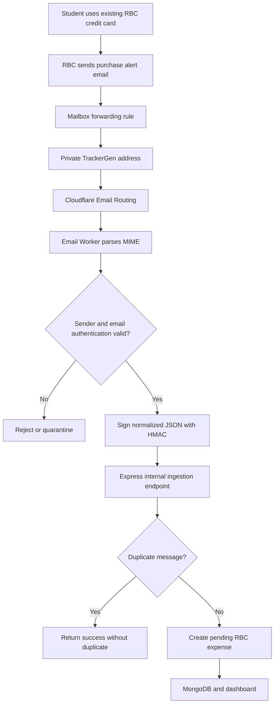

# RBC purchase-email tracking

This branch adds a guarded RBC email-ingestion path. It remains disabled until the environment is configured, so the existing dashboard, Telegram bot, authentication, and transaction CRUD continue to work without email infrastructure.

## Flow



## Server configuration

Copy the relevant values from `.env.example` into `server/.env.local`:

```dotenv
EMAIL_INGESTION_DOMAIN=inbox.your-domain.example
EMAIL_INGESTION_SECRET=<at-least-32-random-characters>
RBC_EMAIL_ALLOWED_DOMAINS=<exact-domain-from-a-real-rbc-alert>
EMAIL_REQUIRE_AUTH_PASS=true
EMAIL_TRANSACTION_TIME_ZONE=America/Vancouver
```

Generate the shared secret locally with a cryptographically secure tool. Configure the same value in the Worker with:

```bash
cd workers/rbc-email-ingestion
npx wrangler secret put EMAIL_INGESTION_SECRET
```

Never commit the real secret or a real forwarded financial email.

## Worker configuration

1. Set `TRACKERGEN_API_URL` in `wrangler.jsonc` to the public HTTPS origin of the Express API.
2. Install dependencies with `npm install` in `workers/rbc-email-ingestion`.
3. Run `npm run check`.
4. Deploy with `npm run deploy`.
5. In Cloudflare Email Routing, enable the email subdomain and route its catch-all rule to this Worker.

## Backend profile endpoints

These routes are ready for a future client or an authenticated API call. This branch does not change the dashboard UI.

```text
GET  /api/profile/email-ingestion
POST /api/profile/email-ingestion/rotate
POST /api/profile/email-ingestion/disable
```

The two POST routes require the existing session cookie and CSRF token. `rotate` returns the new private forwarding address. Do not place the opaque address token in logs.

## User setup

1. Call the authenticated `POST /api/profile/email-ingestion/rotate` endpoint and copy the returned private RBC forwarding address.
2. Enable RBC's Large Credit Card Purchase email alert and choose the lowest permitted threshold.
3. In the user's mailbox, create a rule that forwards only the exact RBC purchase-alert sender and subject to the private address.
4. Make one purchase above the threshold.
5. Confirm that it appears in TrackerGen with `source=email_rbc` and `status=pending`.

## Before production

- Replace the synthetic parser fixtures with a redacted real RBC alert fixture.
- Confirm the exact RBC sender domain and ensure DKIM or DMARC remains aligned after forwarding.
- Test physical-card, online, mobile-wallet, tip, gas-hold, refund, and reversal cases.
- Replace the in-memory rate limiter with shared storage if the API runs on multiple instances.
- Add a reconciliation source before treating pending authorizations as final posted amounts.
