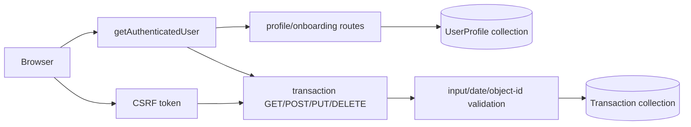
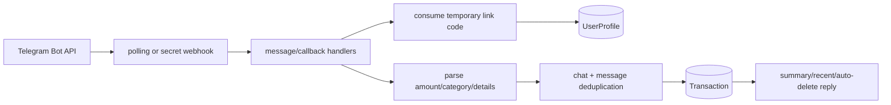
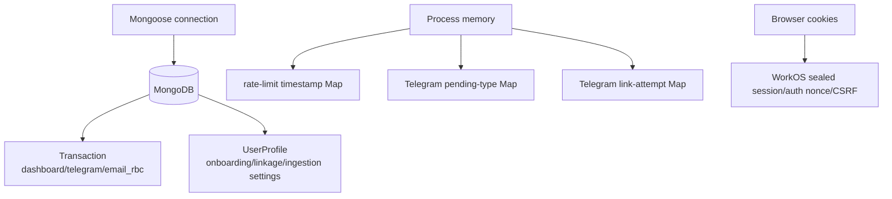
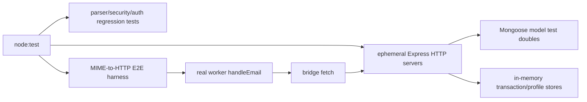

# Server Function Map

## Scope and counting

This inventory covers project-owned `server/**/*.js` files and excludes `server/node_modules`. A counted unit is a declared function, arrow function, method, or executable callback (including option providers, route/listener, timer, promise, collection, validation, and test callbacks). Stable labels are assigned to anonymous callbacks. Schema declarations and class shape are described, but are not independently counted unless they contain a callback. The reconciled total is **203: 134 production functions/callbacks + 69 test functions/callbacks**.

`server/bot/transaction.js` is empty. `server/model/userProfile.js` declares the `UserProfile` schema/model but has no function declarations or callbacks. `workers/rbc-email-ingestion` is a **separate Cloudflare Email Worker deployment**: it receives MIME email and calls the server's internal endpoint. Its functions are not server code and are not included in 203; the E2E test's callbacks remain included because that test is under `server/test`.

### Reconciled file arithmetic

| File | Production | Tests |
|---|---:|---:|
| `server/server.js` | 23 | 0 |
| `server/bot/bot.js` | 41 | 0 |
| `server/bot/transaction.js` | 0 | 0 |
| `server/config/auth.js` | 2 | 0 |
| `server/config/db.js` | 2 | 0 |
| `server/config/rateLimit.js` | 5 | 0 |
| `server/model/data.js` | 1 | 0 |
| `server/model/userProfile.js` | 0 | 0 |
| `server/routes/route.js` | 17 | 0 |
| `server/routes/emailIngestion.js` | 12 | 0 |
| `server/services/authState.js` | 3 | 0 |
| `server/services/emailIngestionSecurity.js` | 17 | 0 |
| `server/services/rbcEmailParser.js` | 11 | 0 |
| `server/test/authState.test.js` | 0 | 1 |
| `server/test/emailIngestionRoute.test.js` | 0 | 20 |
| `server/test/emailIngestionSecurity.test.js` | 0 | 4 |
| `server/test/rbcEmailIngestionE2E.test.js` | 0 | 27 |
| `server/test/rbcEmailParser.test.js` | 0 | 8 |
| `server/test/securityRegression.test.js` | 0 | 9 |
| **Totals** | **134** | **69** |

## Architecture flows

### Startup/auth

```mermaid
flowchart LR
  Env[.env.local] --> Boot[server.js validation]
  Boot --> Mongo[(MongoDB via Mongoose)]
  Mongo --> Express[Express listen]
  Express --> Auth[login/signup/social routes]
  Auth --> WorkOS[WorkOS AuthKit]
  WorkOS --> Callback[OAuth callback + signed state]
  Callback --> Cookie[sealed HTTP-only session]
  Cookie --> Me[/api/auth/me]
  Express --> CSRF[csrf-csrf double-submit protection]
  Express --> Helmet[Helmet/CORS/HTTPS/rate limits]
```

### Transaction/profile CRUD



### Telegram



### Email ingestion/security/parser

```mermaid
flowchart LR
  Mail[RBC alert email] --> Worker[workers/rbc-email-ingestion<br/>separate Cloudflare deployment]
  Worker -->|raw-body HMAC + timestamp| Internal[/api/internal/email/rbc]
  Internal --> Policy[recipient token + sender domain + DMARC/DKIM]
  Policy --> Profile[(UserProfile token hash)]
  Profile --> Parser[RBC bounded parser]
  Parser --> Dedup[owner + message hash]
  Dedup --> Tx[(Transaction email_rbc)]
  Internal --> Diagnostics[redacted structured diagnostics]
```

### Models/data stores



### Test harnesses



## External services and stores

- **MongoDB** via Mongoose: durable `Transaction` and `UserProfile` collections, including Telegram and email idempotency indexes.
- **WorkOS AuthKit/User Management**: authorization URLs, code exchange, sealed-session authentication, and logout URLs.
- **Telegram Bot API** via `node-telegram-bot-api`: polling/webhook updates, messages, callback queries, webhook registration, and deletion.
- **Cloudflare Email Routing/Workers**: `workers/rbc-email-ingestion` parses MIME at the mail edge and forwards signed JSON; it is deployed separately.
- **Process memory**: API rate-limit buckets, Telegram pending transaction types, and Telegram link-attempt counters; none is distributed or durable.
- **Browser cookies**: WorkOS sealed session, OAuth state nonce, and CSRF material. The built SPA may also be served from `client/dist`.

## Complete production function index (134)

### `server/server.js` (23)

1. **P001 `requireEnv` (L54):** requires a real, non-placeholder environment value.
2. **P134 `csrfSecretProvider` (L134):** supplies the process-owned CSRF secret to `doubleCsrf`.
3. **P002 `csrfSessionIdentifier` (L136):** binds CSRF to session cookie or network identity.
4. **P003 `startServerDB` (L149):** connects MongoDB, starts Telegram, then starts HTTP.
5. **P004 `listenReadyCallback` (L157):** logs when Express owns the socket.
6. **P005 `productionHttpsMiddleware` (L175):** rejects non-HTTPS production requests.
7. **P006 `rawEmailBodyVerifier` (L215):** preserves internal-ingestion JSON bytes for HMAC verification.
8. **P007 `setSessionCookie` (L240):** writes the sealed WorkOS session cookie.
9. **P008 `clearSessionCookie` (L245):** clears the session with matching attributes.
10. **P009 `safeReturnTo` (L250):** constrains redirects to local paths.
11. **P010 `isOnboardingIntent` (L263):** identifies a constrained onboarding return path.
12. **P011 `buildAuthorizationUrl` (L268):** creates a WorkOS authorization URL.
13. **P012 `authorizationState` (L283):** creates signed OAuth state and nonce cookie.
14. **P013 `healthRoute` (L293):** reports process health.
15. **P014 `loginRoute` (L300):** starts hosted or offline sign-in.
16. **P015 `signupRoute` (L319):** starts hosted or offline onboarding sign-up.
17. **P016 `socialLoginRoute` (L337):** starts allowlisted Google/GitHub login.
18. **P017 `authCallbackRoute` (L366):** verifies state, exchanges code, sets session, and redirects.
19. **P018 `authMeRoute` (L441):** authenticates the sealed session and returns identity.
20. **P019 `csrfTokenRoute` (L485):** issues a rate-limited CSRF token.
21. **P020 `logoutRoute` (L493):** clears local session and obtains provider logout URL.
22. **P021 `apiNotFoundMiddleware` (L529):** returns a fixed API 404.
23. **P022 `spaFallbackRoute` (L539):** serves the built SPA shell.

### `server/bot/bot.js` (41)

1. **P023 `todayIsoDate` (L60):** returns today's ISO date.
2. **P024 `formatMoney` (L65):** formats absolute currency.
3. **P025 `formatSignedMoney` (L73):** formats signed currency.
4. **P026 `parseAmountToken` (L79):** parses and bounds a Telegram amount.
5. **P027 `normalizeCategory` (L86):** maps aliases to allowed categories.
6. **P028 `parseTransactionText` (L96):** parses transaction message fields.
7. **P029 `amountTokenFinder` (L99):** finds the first valid amount token.
8. **P030 `buildLinkedProfileQuery` (L130):** requires chat and user identity.
9. **P031 `findLinkedProfile` (L141):** resolves the linked profile.
10. **P032 `telegramIdentityKey` (L147):** keys pending state by chat/user.
11. **P033 `checkLinkRateLimit` (L152):** enforces process-local link limits.
12. **P034 `getTelegramUser` (L170):** extracts Telegram user metadata.
13. **P035 `getTelegramMessageIdentity` (L178):** normalizes message identity.
14. **P036 `getAddTransactionKeyboard` (L187):** builds fixed inline buttons.
15. **P037 `sendAddTransactionButtons` (L201):** sends transaction choices.
16. **P038 `getTransactionDetailExample` (L206):** selects a safe input example.
17. **P039 `scheduleMessageDelete` (L213):** schedules message cleanup.
18. **P040 `delayedDeleteCallback` (L219):** performs best-effort Telegram deletion.
19. **P041 `sendAutoDeletingMessage` (L232):** sends and schedules deletion.
20. **P042 `getWebhookPath` (L239):** extracts the configured webhook path.
21. **P043 `validateTelegramWebhookSecret` (L248):** fails closed on weak webhook secrets.
22. **P044 `sendMonthlySummary` (L257):** aggregates current-month transactions.
23. **P045 `monthlyIncomeFilter` (L270):** selects positive transactions.
24. **P046 `monthlyIncomeReducer` (L272):** totals monthly income.
25. **P047 `monthlyExpenseFilter` (L275):** selects negative transactions.
26. **P048 `monthlyExpenseReducer` (L277):** totals expense magnitudes.
27. **P049 `sendRecentTransactionSummary` (L295):** reports recent owner transactions.
28. **P050 `recentIncomeFilter` (L307):** selects recent income.
29. **P051 `recentIncomeReducer` (L309):** totals recent income.
30. **P052 `recentExpenseFilter` (L312):** selects recent expenses.
31. **P053 `recentExpenseReducer` (L314):** totals recent expense magnitudes.
32. **P054 `recentLineMapper` (L317):** formats each recent transaction.
33. **P055 `handleLinkCommand` (L337):** consumes a link code and binds Telegram identity.
34. **P056 `handleTransactionCommand` (L388):** validates, deduplicates, and creates a transaction.
35. **P057 `startTelegramBot` (L459):** configures polling or webhook mode.
36. **P058 `pollingErrorListener` (L485):** records polling failures.
37. **P059 `callbackQueryListener` (L490):** handles income/expense button choices.
38. **P060 `messageListener` (L531):** routes Telegram commands and pending entries.
39. **P061 `telegramWebhookRoute` (L662):** authenticates and processes webhook updates.
40. **P062 `webhookRegistrationResolved` (L677):** reports successful webhook registration.
41. **P063 `webhookRegistrationRejected` (L681):** reports failed webhook registration.

### `server/config/auth.js` (2)

1. **P064 `createAuthHelpers` (L4):** binds authentication behavior to configuration.
2. **P065 `getAuthenticatedUser` (L12):** resolves offline or sealed-session identity.

### `server/config/db.js` (2)

1. **P066 `connectDB` (L5):** opens MongoDB or terminates on failure.
2. **P067 `closeConnection` (L20):** closes Mongoose cleanly.

### `server/config/rateLimit.js` (5)

1. **P068 `createRateLimiter` (L7):** creates a process-local sliding-window limiter.
2. **P069 `expiredBucketCleanup` (L9):** periodically prunes stale buckets.
3. **P070 `cleanupRecentFilter` (L14):** retains active cleanup timestamps.
4. **P071 `rateLimitMiddleware` (L25):** rejects identities over the limit.
5. **P072 `requestRecentFilter` (L30):** retains active request timestamps.

### `server/model/data.js` (1)

1. **P073 `nonZeroAmountValidator` (L40):** rejects zero-valued persisted transactions.

### `server/model/userProfile.js` (0)

No function declarations or callbacks; this file defines the `UserProfile` schema, token/linkage fields, unique token-hash index, and model.

### `server/routes/route.js` (17)

1. **P074 `isValidIsoDate` (L25):** validates real ISO calendar dates.
2. **P075 `dateSegmentNumberMapper` (L27):** converts date segments to numbers.
3. **P076 `validateTransactionInput` (L38):** validates transaction API input.
4. **P077 `validateOnboardingInput` (L70):** validates onboarding preferences.
5. **P078 `createTelegramLinkCode` (L92):** creates a high-entropy link code.
6. **P079 `maskChatId` (L97):** creates a chat-ID preview.
7. **P080 `maskTelegramId` (L103):** creates a user-ID preview.
8. **P081 `isValidObjectId` (L109):** guards transaction identifier queries.
9. **P082 `buildRouter` (L114):** constructs profile and transaction routes.
10. **P083 `getProfileRoute` (L123):** returns the owner's profile.
11. **P084 `completeOnboardingRoute` (L143):** upserts validated onboarding state.
12. **P085 `getTelegramProfileRoute` (L191):** returns owner-visible Telegram linkage.
13. **P086 `createTelegramLinkCodeRoute` (L225):** persists a temporary link code.
14. **P087 `listTransactionsRoute` (L276):** lists owner-scoped transactions.
15. **P088 `createTransactionRoute` (L310):** creates an owner-scoped transaction.
16. **P089 `updateTransactionRoute` (L347):** updates by owner and ID.
17. **P090 `deleteTransactionRoute` (L398):** deletes by owner and ID.

### `server/routes/emailIngestion.js` (12)

1. **P091 `safeCorrelationId` (L22):** accepts UUIDs or generates one.
2. **P092 `emitDiagnostic` (L29):** emits redacted structured diagnostics.
3. **P093 `buildAddress` (L34):** formats the private forwarding address.
4. **P094 `publicEmailIngestionProfile` (L39):** shapes owner-visible ingestion state.
5. **P095 `isBoundedString` (L51):** enforces worker string limits.
6. **P096 `validateWorkerPayload` (L57):** validates the complete worker payload.
7. **P097 `isDuplicateKeyError` (L72):** recognizes the email idempotency constraint.
8. **P098 `buildEmailIngestionRouter` (L81):** constructs user controls and internal route.
9. **P099 `getEmailIngestionProfileRoute` (L109):** returns ingestion setup.
10. **P100 `rotateEmailIngestionRoute` (L130):** rotates and enables the forwarding token.
11. **P101 `disableEmailIngestionRoute` (L175):** disables owner ingestion.
12. **P102 `internalRbcEmailRoute` (L196):** authenticates, parses, deduplicates, and persists alerts.

### `server/services/authState.js` (3)

1. **P103 `signature` (L6):** HMAC-signs OAuth state payloads.
2. **P104 `createAuthState` (L11):** creates nonce-bound expiring state.
3. **P105 `verifyAuthState` (L18):** verifies signature, nonce, shape, and age.

### `server/services/emailIngestionSecurity.js` (17)

1. **P106 `sha256Hex` (L8):** hashes tokens and message IDs.
2. **P107 `signEmailIngestionPayload` (L13):** signs timestamp and raw bytes.
3. **P108 `verifyEmailIngestionSignature` (L24):** verifies HMAC and freshness.
4. **P109 `extractEmailAddress` (L69):** normalizes limited address forms.
5. **P110 `parseAllowedDomains` (L78):** parses configured sender domains.
6. **P111 `domainNormalizer` (L83):** trims and lowercases a domain.
7. **P112 `validDomainFilter` (L87):** filters malformed domains.
8. **P113 `validDomainLabelCheck` (L91):** validates every DNS label.
9. **P114 `isAllowedSender` (L97):** checks claimed sender-domain membership.
10. **P115 `allowedSenderBoundaryCheck` (L106):** checks exact/subdomain boundaries.
11. **P116 `escapeRegExp` (L111):** escapes configured domains.
12. **P117 `hasPassingEmailAuthentication` (L116):** requires aligned DMARC or DKIM.
13. **P118 `alignedDomainFilter` (L124):** narrows allowed domains to From alignment.
14. **P119 `dmarcPassCheck` (L131):** examines each DMARC pass result.
15. **P120 `dmarcDomainAlignmentCheck` (L135):** verifies header-from alignment.
16. **P121 `dkimDomainPassCheck` (L141):** checks aligned DKIM evidence.
17. **P122 `extractRecipientToken` (L151):** extracts a bounded token at the configured domain.

### `server/services/rbcEmailParser.js` (11)

1. **P123 `RbcEmailParseError.constructor` (L7):** creates stable parser errors.
2. **P124 `cleanText` (L15):** normalizes and bounds email text.
3. **P125 `parseAmount` (L25):** extracts a bounded purchase amount.
4. **P126 `cleanMerchant` (L45):** normalizes merchant text.
5. **P127 `parseMerchant` (L54):** extracts recognized merchant phrasing.
6. **P128 `parseCardSuffix` (L65):** extracts non-secret last four digits.
7. **P129 `formatDateInTimeZone` (L73):** formats a date in transaction timezone.
8. **P130 `datePartEntryMapper` (L82):** maps formatter parts to entries.
9. **P131 `parseDate` (L88):** parses alert date or delivery fallback.
10. **P132 `categorizeMerchant` (L108):** maps merchant patterns to categories.
11. **P133 `parseRbcPurchaseEmail` (L118):** produces a pending RBC transaction candidate.

### `server/bot/transaction.js` (0)

Empty file; no declarations, callbacks, or runtime behavior.

## Complete test function index (69)

### `server/test/authState.test.js` (1)

1. **T001 `authStateLifecycleTest` (L8):** verifies signing, browser nonce binding, tamper rejection, and expiry.

### `server/test/emailIngestionRoute.test.js` (20)

1. **T002 `withTestServer` (L14):** runs an isolated Express ingestion server.
2. **T003 `testRawBodyVerifier` (L20):** captures request bytes.
3. **T004 `unauthenticatedUserDouble` (L28):** supplies no browser user.
4. **T005 `listenerReadyResolver` (L39):** resolves ephemeral server startup.
5. **T006 `serverClosePromiseExecutor` (L45):** wraps HTTP shutdown.
6. **T007 `serverCloseCallback` (L48):** resolves/rejects shutdown.
7. **T008 `createPayload` (L55):** builds a valid worker payload.
8. **T009 `signedPost` (L70):** sends signed ingestion JSON.
9. **T010 `validRouteTest` (L87):** verifies pending expense creation.
10. **T011 `validFindOneDouble` (L95):** returns the controlled profile.
11. **T012 `validUpdateOneDouble` (L97):** simulates profile timestamp update.
12. **T013 `validCreateDouble` (L99):** captures and returns transaction data.
13. **T014 `validServerScenario` (L106):** drives the valid HTTP request.
14. **T015 `invalidSignatureTest` (L124):** verifies pre-database rejection.
15. **T016 `databaseAccessSentinelDouble` (L128):** detects forbidden profile access.
16. **T017 `invalidSignatureServerScenario` (L135):** drives the forged request.
17. **T018 `duplicateRouteTest` (L146):** verifies idempotent duplicate response.
18. **T019 `duplicateFindOneDouble` (L152):** returns the duplicate test profile.
19. **T020 `duplicateCreateDouble` (L154):** throws the compound duplicate-key error.
20. **T021 `duplicateServerScenario` (L163):** drives duplicate delivery.

T019 and T020 are intentionally separate duplicate-path test doubles and are not collapsed.

### `server/test/emailIngestionSecurity.test.js` (4)

1. **T022 `validHmacTest` (L15):** accepts a current valid signature.
2. **T023 `tamperAndExpiryTest` (L26):** rejects stale and modified payloads.
3. **T024 `recipientTokenPolicyTest` (L52):** restricts recipient token/domain shape.
4. **T025 `senderAuthenticationPolicyTest` (L63):** requires domain and aligned authentication.

### `server/test/rbcEmailIngestionE2E.test.js` (27)

1. **T026 `rawMime` (L14):** builds controlled MIME.
2. **T027 `cloudflareMessage` (L29):** adapts MIME to EmailMessage shape.
3. **T028 `unexpectedRejectMethod` (L40):** fails on unexpected SMTP rejection.
4. **T029 `withEmailIngestionTestServer` (L45):** runs the full local boundary.
5. **T030 `e2eProfileFindOneDouble` (L49):** resolves enabled controlled profile.
6. **T031 `e2eProfileUpdateOneDouble` (L53):** records profile updates.
7. **T032 `e2eTransactionCreateDouble` (L57):** stores unique transactions and throws duplicates.
8. **T033 `existingMessagePredicate` (L59):** detects repeated message hashes.
9. **T034 `loggerEntryMapper` (L71):** builds severity logger entries.
10. **T035 `diagnosticRecorder` (L74):** records structured diagnostics.
11. **T036 `e2eRawBodyVerifier` (L80):** captures ingestion bytes.
12. **T037 `e2eUnauthenticatedUserDouble` (L84):** supplies no browser session.
13. **T038 `e2eListenerReadyResolver` (L96):** resolves listener startup.
14. **T039 `bridgeFetch` (L99):** redirects worker calls locally.
15. **T040 `e2eServerClosePromiseExecutor` (L102):** wraps E2E shutdown.
16. **T041 `e2eServerCloseCallback` (L104):** completes E2E shutdown.
17. **T042 `successAndDuplicateE2eTest` (L109):** verifies creation and idempotency.
18. **T043 `successAndDuplicateScenario` (L111):** delivers the same MIME twice.
19. **T044 `createdDiagnosticPredicate` (L122):** finds creation diagnostics.
20. **T045 `duplicateDiagnosticPredicate` (L124):** finds duplicate diagnostics.
21. **T046 `rejectionE2eTest` (L133):** verifies forged/malformed/unrecognized rejection.
22. **T047 `rejectionScenario` (L135):** drives all rejection paths.
23. **T048 `signatureDiagnosticPredicate` (L168):** finds signature rejection.
24. **T049 `payloadDiagnosticPredicate` (L170):** finds payload rejection.
25. **T050 `authenticationDiagnosticPredicate` (L172):** finds auth-policy rejection.
26. **T051 `parserDiagnosticPredicate` (L174):** finds parser rejection.
27. **T069 `diagnosticMetadataKeyAllowlistPredicate` (L177):** requires every diagnostic field name to be in the metadata allowlist.

### `server/test/rbcEmailParser.test.js` (8)

1. **T052 `labelledAlertTest` (L6):** verifies labelled alert parsing.
2. **T053 `sentenceAlertTest` (L28):** verifies sentence-style parsing.
3. **T054 `missingMerchantTest` (L43):** verifies merchant omission rejection.
4. **T055 `missingMerchantParseAttempt` (L46):** invokes the failing parse.
5. **T056 `missingMerchantErrorPredicate` (L53):** checks structured error code.
6. **T057 `unrelatedEmailTest` (L58):** verifies unrelated content rejection.
7. **T058 `unrelatedEmailParseAttempt` (L61):** invokes the failing parse.
8. **T059 `unrelatedEmailErrorPredicate` (L68):** checks non-purchase error code.

### `server/test/securityRegression.test.js` (9)

1. **T060 `telegramIdentityBindingTest` (L12):** requires chat and initiating user.
2. **T061 `linkCodeEntropyTest` (L21):** samples link-code uniqueness and shape.
3. **T062 `webhookSecretTest` (L31):** verifies webhook fail-closed behavior.
4. **T063 `missingSecretThrower` (L33):** exercises missing secret.
5. **T064 `weakSecretThrower` (L35):** exercises weak secret.
6. **T065 `strongSecretNonThrower` (L37):** exercises accepted secret.
7. **T066 `disabledWebhookNonThrower` (L39):** exercises disabled mode.
8. **T067 `transactionValidationRegressionTest` (L43):** checks zero and impossible dates.
9. **T068 `mongooseCleanupHook` (L58):** removes registered models after tests.

## Verification

- Production IDs: P001-P134 = **134**.
- Test IDs: T001-T069 = **69**.
- Grand total: **134 + 69 = 203**.
- Empty/no-function files are retained explicitly: `bot/transaction.js` = 0 and `model/userProfile.js` = 0.
- The two webhook registration promise callbacks are P062 and P063.
- Duplicate-route test doubles are separate entries T019 and T020; the earlier valid-path doubles T011-T013 also remain distinct.
- The CSRF secret provider is independently counted as P134, and the E2E diagnostic metadata-key predicate is independently counted as T069.
